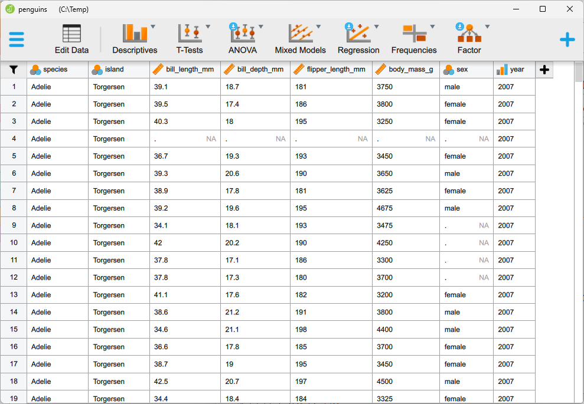
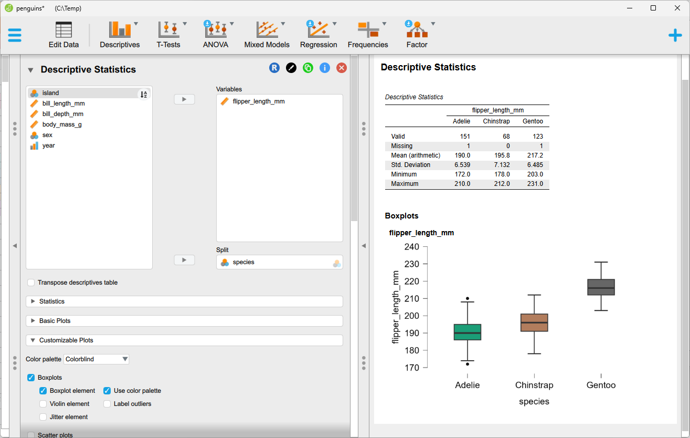
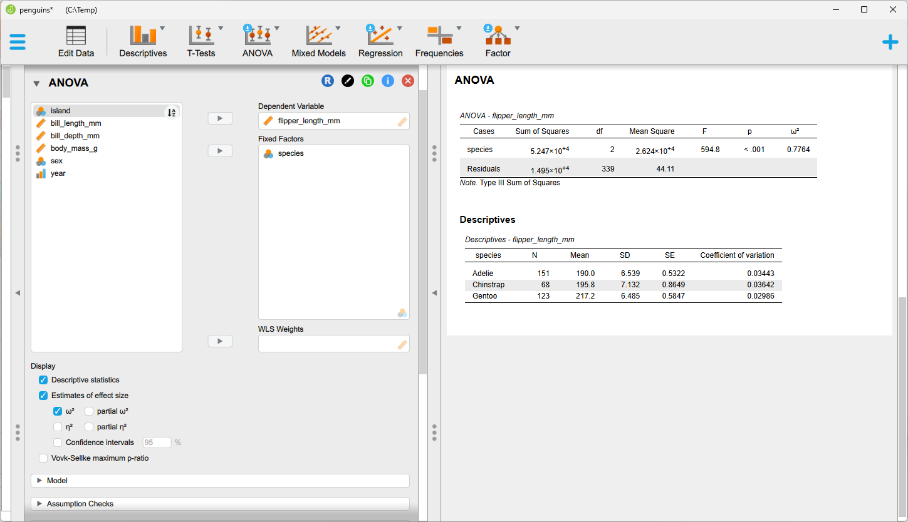
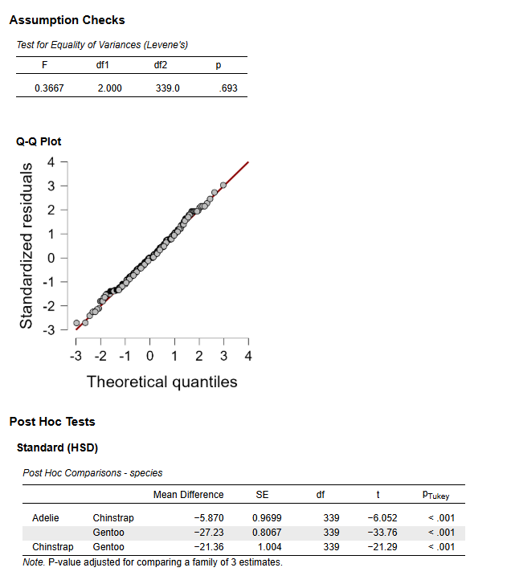
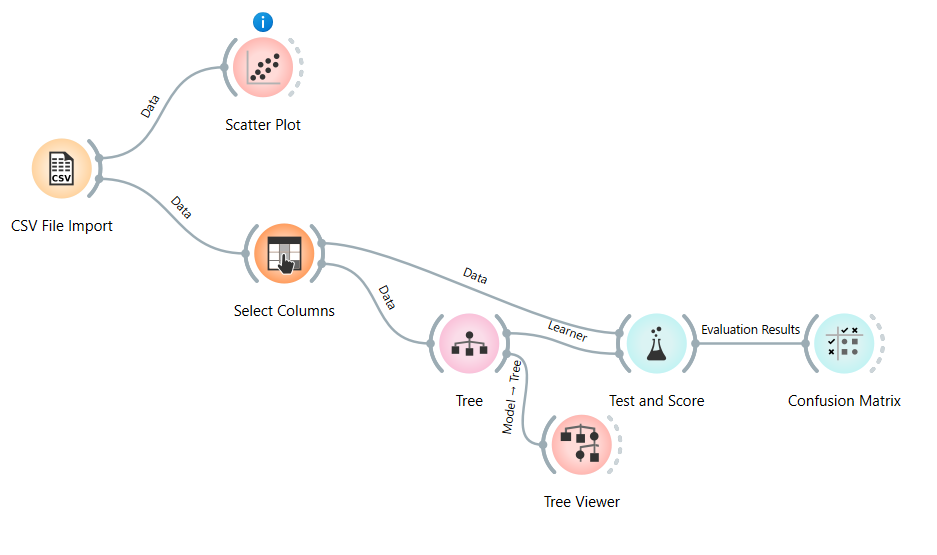
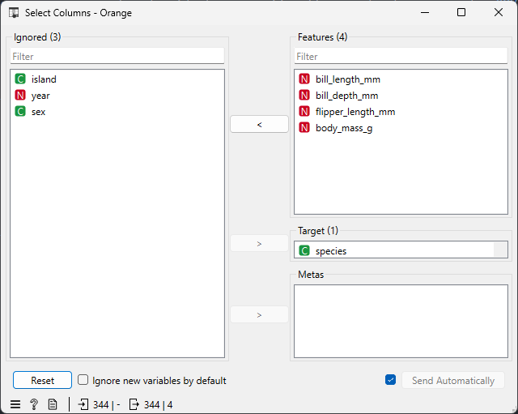
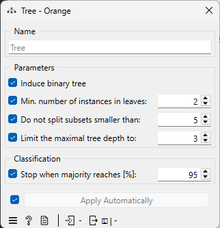
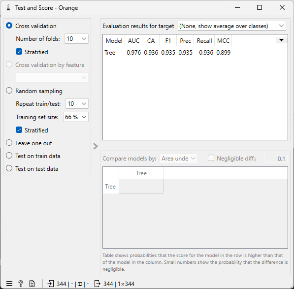
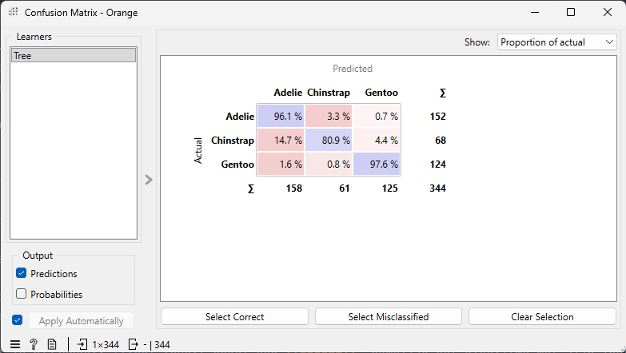
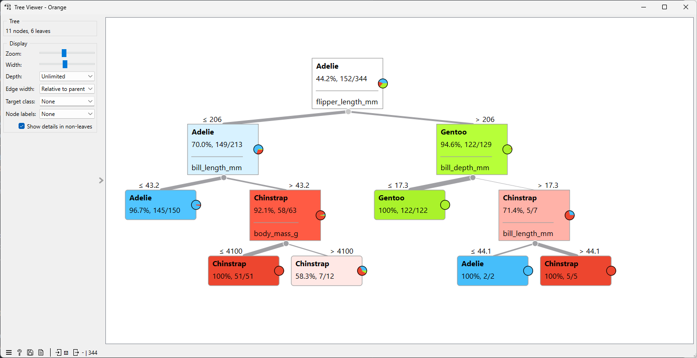

Ook als je geen kennis hebt van R of Python, kan je zinvolle inzichten halen uit je data.
In deze blogpost introduceren we enkele gratis tools, die je toelaten om je data te verkennen, 
statistische toetsen uit te voeren en zelf machine-learningmodellen te bouwen door 
te klikken en te slepen in een grafische gebruikersomgeving.
De twee tools die we voorstellen in deze blogpost zijn JASP en Orange Data Mining.
Deze softwarepakketten laten je toe om 
je data volledig op je eigen machine te analyseren, zonder cloudaccount of upload. 
Voor de kernfunctionaliteit, zoals de analyses in deze post, verlaat je data je computer niet. 
Gebruik je in Orange echter widgets of add-ons die online diensten aanspreken, dan kan dat veranderen.
Controleer dat vooraf als privacy een zorg is.

## Zonder R of Python?

Het gebruik van R of Python geeft je heel veel flexibiliteit, maar komt ook met een drempel.
Je moet een programmeeromgeving installeren, syntax en bibliotheken leren, 
en de onvermijdelijke fouten debuggen. Als onderzoeker wil je echter vooral snel antwoorden 
op je vragen over jouw data.

Tools die gebruikmaken van een grafische gebruikersinterface bieden een aantal voordelen 
t.o.v. het gebruik van R of Python. Er is meestal een *lage instapdrempel*; je bent dus snel aan de slag.
Bovendien krijg je *visuele feedback* en je ziet meteen wat er met je data gebeurt.

Het nadeel van een grafische gebruikersinterface is dat er mogelijks wat minder flexibiliteit is; als een 
bepaalde optie niet ingebouwd is, dan kan je die ook niet gebruiken.

## JASP 

[JASP](https://jasp-stats.org/) (Jeffreys's Amazing Statistics Program) wordt aan de Universiteit van Amsterdam ontwikkeld als een gratis en open source alternatief voor SPSS. Als je 
een verkennende ronde wil doen van je data of als je
klassieke (of Bayesiaanse) toetsen wil uitvoeren op je data, dan is JASP hier heel geschikt voor.

JASP heeft een aantal sterke punten:

- de resultaten passen zich "live" aan: als je een optie aan- of uitvinkt, dan verandert de uitvoer onmiddellijk;
- het aanbod van analyses is heel breed: t-toetsen, ANOVA, regressie- en correlatieanalyses en zelfs factoranalyse en meer zijn ingebouwd;
- JASP ondersteunt voor heel veel analyses zowel een "klassieke" als een "Bayesiaanse" variant;
- de uitvoer, zoals tabellen en grafieken, is professioneel opgemaakt zodat je die heel gemakkelijk in een rapport of artikel kan opnemen;
- data, analyses en rapporten worden in één bestand bewaard, zodat alles reproduceerbaar is.

JASP heeft een eenvoudige data-editor (knop `Edit Data`): als je data foutieve of ontbrekende 
waarden bevat, dan is het niet zo handig om deze aan te passen binnen JASP zelf. Hiervoor kan je eventueel 
teruggrijpen naar andere software, zoals klassieke werkbladsoftware (bv. Excel) of een alternatief
voor JASP, nl. [Jamovi](https://www.jamovi.org/index.html). Als je echt "zware" dataopschoning wil of moet doen, 
dan is er hiervoor een specifiek programma, nl. [OpenRefine](https://openrefine.org/).

## Orange 

[Orange](https://orangedatamining.com/) wordt onderhouden door de Universiteit van Ljubljana en heeft een andere aanpak.
Je sleept blokjes (widgets) op een canvas en verbindt ze door middel van lijnen die aangeven hoe de data "vloeit" doorheen
de *workflow* die je op deze manier opbouwt. Elk blokje doet één ding, zoals data inladen, filteren, visualiseren of een model trainen.
Door te klikken op een widget kan je de werking ervan via een grafische gebruikersinterface aanpassen.

De sterke punten van Orange zijn:

- de aanpak is heel visueel: de hele analyse is zichtbaar als een "stroomschema", wat het gemakkelijk maakt om erover te redeneren;
- het is gemakkelijk om je data te verkennen door het uitgebreide gamma aan plots: scatterplots, boxplots, heatmaps, histogrammen; deze zijn ook allemaal interactief;
- het beschikt over veel ingebouwde machine-learningmodellen voor classificatie, regressie en clustering die via cross-validatie kunnen worden geëvalueerd;
- er is een bibliotheek van "add-ons" die je toelaat de functionaliteiten van Orange uit te breiden naar bv. tekst- of beeldanalyse.

Orange is dus minder gericht op "klassieke" statistiek en meer op machine learning.

## Beperkingen

Als je werkt met dergelijke tools (en zonder code), dan zijn hier ook nadelen aan verbonden:

- het is minder gemakkelijk om analyses volledig te automatiseren;
- voor (zeer) grote datasets zijn deze tools minder geschikt;
- ze zijn minder flexibel dan werken met code: als je bijzondere (niet-standaard) analyses wil uitvoeren of eigen modellen wil bouwen, dan heb je meestal wel Python of R nodig.

Een mooie uitvoer is echter geen garantie voor een betrouwbaar resultaat. Het principe *garbage in, garbage out* geldt ook hier: foutieve of onvolledige data leveren foutieve conclusies op, hoe verzorgd de tabellen en grafieken er ook uitzien. Controleer daarom steeds de **kwaliteit van je data** voor je begint.

## Welke tool te kiezen?

Hieronder presenteren we een korte tabel die je kan helpen om een keuze te maken tussen JASP en Orange.

|                |  JASP                               |  Orange                                         |
|:---------------|:------------------------------------|:------------------------------------------------|
| **Focus**      | Statistisch toetsen                 | Machine Learning                                |
| **Werkwijze**  | Menu's en opties                    | Visuele workflows met widgets                   |
| **Sterk in**   | Klassieke en Bayesiaanse statistiek | Visualisatie, clustering, voorspellen           |
| **Best voor**  | Onderzoek, rapportage               | Data-exploratie, onderwijs, prototypes          |

De twee tools sluiten elkaar niet uit: je kan de data eerst verkennen in Orange en nadien de hypotheses
die je hierdoor formuleert formeel toetsen m.b.v. JASP.
Deze blogpost toont verder de sterkte van elke tool: formele hypotheses testen in JASP, en verkennen en voorspellen in Orange.
Verkennen van de data is echter ook mogelijk in JASP door de uitgebreide grafieken die je kan maken.
JASP beschikt bovendien over extra modules die je kan toevoegen worden waarmee ook machine-learningmodellen kunnen worden 
gebouwd; beide tools bezitten m.a.w. overlappende functionaliteiten.

## Kort voorbeeld

We werken met de gekende [Palmer Penguins dataset](https://raw.githubusercontent.com/allisonhorst/palmerpenguins/refs/heads/main/inst/extdata/penguins.csv).
Deze bevat gegevens over 344 pinguïns die behoren tot 3 verschillende soorten.  We stellen ons de volgende vragen:

1. Verschillen de pinguïnsoorten van elkaar?
2. Kunnen we de soort voorspellen vanuit de gegevens?

Deze eerste vraag beantwoorden we m.b.v. JASP, voor de tweede gebruiken we Orange.

Download de dataset naar je harde schijf zodat je die later kan inladen in JASP en Orange.

In deze blogpost gebruiken  we JASP 0.98.1 Orange 3.40.

### JASP: verschilt de flipperlengte per soort?

We laden de pinguïndata in JASP (`Open -> Computer -> Browse`) en stellen een eenvoudige vraag: **verschilt de flipperlengte tussen de drie soorten**? 
Een flipper is de "vleugel" van een pinguïn, en de gegevens hiervan worden opgeslagen in de kolom `flipper_length_mm`.

Dit is een klassieke vraag voor een *ANOVA* (variantieanalyse). Die vergelijkt de gemiddelden van meer dan twee groepen in één keer.

#### Data-exploratie

Voor we de toets uitvoeren is het een goed idee om eerst eventjes de data te bekijken. 
Dat doe je in JASP onder *Descriptives*: splits `flipper_length_mm` op per `species` en vraag een boxplot aan.

Op het eerste zicht ligt de flipperlengte van Gentoo duidelijk hoger dan die van de andere twee soorten. In de tabel `Descriptive Statistics` lees je de gemiddelden af: ongeveer 190 mm bij Adelie, 196 mm bij Chinstrap en 217 mm bij Gentoo.
Door de ANOVA uit te voeren kunnen we nagaan of dit verschil groter is dan wat je door toeval zou verwachten.

#### De ANOVA uitvoeren

De ANOVA wordt uitgevoerd door (`ANOVA -> Classical -> Anova`) te kiezen uit de band bovenaan de gebruikersinteface. 
Verplaats `flipper_length_mm` naar `Dependent Variable` en `species` naar `Fixed Factors`.  De analyse wordt onmiddellijk uitgevoerd.

Als je in het linkerscherm opties aan- of uitklikt zal het rechterscherm zich onmiddellijk aanpassen.

Vink bijvoorbeeld de volgende extra opties aan:
- *Descriptive statistics*
- *Estimates of effect size (ω²)*
- *Post hoc tests* (`Tukey`, verplaats `species` naar de rechterkolom): welke soorten verschillen van elkaar?
- *Assumption checks* (`Homogeneity tests` en `Q-Q-plot residuals`): zijn de aannames van de ANOVA geschonden?

De volgende *extra* uitvoer wordt dan getoond:

#### Aannames controleren

Een ANOVA werkt alleen betrouwbaar als aan een aantal aannames is voldaan. JASP maakt het gemakkelijk om die te controleren:

- **Gelijke varianties**: de Levene-toets onder *Assumption checks*. De Levene-toets is hier niet significant, wat erop wijst dat er geen reden is om te twijfelen aan de gelijkheid van de varianties.
- **Normaliteit van de residuen**: uit de Q-Q-plot blijkt dat de residuen ongeveer normaal verdeeld lijken.
- **Onafhankelijke waarnemingen**: dit kan JASP niet nagaan: het gaat om metingen van verschillende pinguïns, maar die zijn verzameld op drie eilanden en in drie jaren. Dieren uit dezelfde groep lijken mogelijk meer op elkaar, dus de aanname is niet helemaal vervuld. Bij een groot verschil tussen de soorten verandert dat de conclusie hoogstwaarschijnlijk niet.

Het is belangrijk om steeds de aannames van je statistische test te controleren ook al wordt die door de software met één klik op de knop uitgevoerd.
De conclusies van een statistische test zijn immers enkel betrouwbaar als de aannames waarop de test is gebouwd voldaan zijn. 

#### De resultaten van de ANOVA interpreteren

**De ANOVA-tabel.** De toets geeft een zeer kleine p-waarde (F(2, 339) = 594,8 en  p < 0,001). Er is m.a.w. een significant verschil in gemiddelde flipperlengte tussen de soorten. 
De p-waarde zegt alleen dat er *ergens* een verschil is, maar niet hoe groot het is en niet tussen welke soorten.

**De effectgrootte.** Daarvoor is er ω². Die geeft aan welk deel van de variatie in flipperlengte samenhangt met de soort. Hier is ω² = 0,7764, dus ongeveer 78% van de variatie
in flipperlengte wordt verklaard door de verschillende soorten. Dat is een groot effect. 

**De post-hoctoetsen.** Met de Tukey-toets vergelijk je de soorten paarsgewijs: Adelie met Chinstrap, Adelie met Gentoo en Chinstrap met Gentoo. 
De toets corrigeert voor het feit dat je meerdere vergelijkingen tegelijk doet. Je ziet dat er significante verschillen zijn tussen elk paar soorten.

#### Ontbrekende waarden

Twee pinguïns hebben geen metingen voor de flipperlengte.  Dat zag je al in de rij `Missing` van de tabel `Descriptive Statistics`.
JASP laat zulke rijen automatisch weg uit de analyse, dus we werken met 342 waarnemingen in plaats van 344. Let op dit soort details. 
Je kan dit niet rechtstreeks  zien in de ANOVA-tabel, enkel onrechtstreeks in het aantal vrijheidsgraden.

### Orange: kunnen we de soort voorspellen?

In JASP vroegen we of de soorten **verschillen**. In Orange stellen we de omgekeerde vraag: **kunnen we de soort voorspellen** uit de metingen van een pinguïn? We bouwen daarvoor stap voor stap een workflow. Elk blokje (widget) doet één ding, en de lijnen ertussen tonen hoe de data door de analyse "vloeien".

De flow die we finaal zullen opbouwen is deze:

#### Stap 1: de data inladen

Sleep een *CSV File Import*-widget op het canvas en dubbelklik erop. Kies je `penguins.csv` en controleer in de voorbeeldweergave of de kolommen goed zijn herkend. 

#### Stap 2: de data bekijken met een Scatter Plot

Voor je modellen bouwt, kijk je naar de data. Sleep een *Scatter Plot* op het canvas en verbind hem met *CSV File Import*. Klik op de rechterrand van het eerste blokje en sleep naar het tweede. De lijn krijgt automatisch het label "Data".

Dubbelklik op de scatter plot en zet `bill_length_mm` op de x-as en `bill_depth_mm` op de y-as. Kleur de punten naar `species`.

Je ziet meteen dat de soorten relatief goed van elkaar te onderscheiden zijn op basis van deze kenmerken. 
Dat is het voordeel van een visuele aanpak: je hebt een eerste indruk nog voor je een model bouwt. Als je op een groepje punten klikt, kan je ze ook selecteren en doorgeven aan een volgende widget, maar wij zullen verder bouwen op de *CSV File Import* widget.

::: {.callout-note}
## Opmerking

Bemerk hier dat Orange in deze eerste stap het type van de kolommen juist heeft herkend: `bill_length_mm` en  `bill_depth_mm` zijn
herkend als numerieke kolommen, terwijl `species` herkend is als categorische variabele. Dit zie je in de scatter plot aan 
de rode N en de groene C bij de namen van deze kolommen. Mocht dat niet zo zijn, dan moet 
je dit aanpassen in de *CSV File Import* widget.

:::

#### Stap 3: kiezen wat we voorspellen en waarmee

Sleep een *Select Columns*-widget op het canvas en verbind de *CSV File Import* hiermee. Hier bepaal je de *rol* van elke kolom:

- **Doelvariabele** (wat we willen voorspellen): `species`.
- **Kenmerken** (waarmee we voorspellen): `bill_length_mm, bill_depth_mm, flipper_length_mm, body_mass_g`.
- Kolommen die we **niet** gebruiken, zet je in het vak *Ignored*.

Zonder doelvariabele kan Orange niet beoordelen of een voorspelling juist is. Zet je hier iets verkeerd, dan krijg je later in *Test and Score* niets te zien.

::: {.callout-warning}
## Keuze van de kenmerken?

 We laten `island` buiten beschouwing omdat Gentoo enkel op Biscoe voorkomt en Chinstrap enkel op Dream. (Dit kan je controleren m.b.v. een scatter plot.)
 Het eiland verraadt dus voor een deel al de soort. 

Verder denken we dat het jaar van de meting en het geslacht van de pinguïn niet relevant zijn om de soort te voorspellen, daarom nemen we die ook niet mee
in het model.

Door de metingen als enige voorspellers te nemen, testen we of de pinguïns zelf van elkaar te onderscheiden zijn.

:::

#### Stap 4: een model kiezen

Sleep een *Tree*-widget op het canvas. Voorlopig krijgt deze widget geen verbindingen.
Een *beslissingsboom* stelt een reeks ja/nee-vragen over de metingen ("is de flipperlengte groter dan x mm?") tot hij een soort kan voorspellen.

Dubbelklik op *Tree* en beperk de complexiteit, zodat de boom leesbaar blijft: stel bijvoorbeeld de maximale diepte in op `3`.

#### Stap 5: beoordelen hoe goed het model werkt

Sleep een *Test and Score*-widget op het canvas en maak twee verbindingen:

1. van *Select Columns* naar *Test and Score*, met het kanaal "Data";
2. van *Tree* naar *Test and Score*, met het kanaal "Learner".

Dat tweede kanaal is bijzonder: *Tree* levert enkel een **recept**, namelijk het algoritme met zijn instellingen. *Test and Score* krijgt de eigenlijke
data van de *Select Columns* widget en doet het echte werk.

Kies links in *Test and Score* voor **cross-validation** met 10 folds. Orange doet dan het volgende:

1. De data worden in 10 gelijke delen verdeeld.
2. Op 9 delen wordt een boom getraind, op het overblijvende deel getest. Hier wordt onder andere gekeken hoeveel van de pinguïns in het overblijvende deel correct worden voorspeld.
3. Dit wordt 10 keer herhaald, telkens met een ander testdeel.

Zo beoordeel je het model op pinguïns die het tijdens het trainen **niet gezien heeft**. Een model dat enkel goed scoort op data waarop het getraind is, zegt niets over hoe het presteert op nieuwe data.

De nauwkeurigheid (*CA*, classification accuracy) bedraagt 93,6%. Van de meeste pinguïns wordt m.a.w. correct voorspeld tot welke
soort ze behoren. Deze nauwkeurigheid wordt bepaald door de resultaten van de 10 "overblijvende" delen te combineren. Elke pinguïn heeft
m.a.w. negen keer als trainingsvoorbeeld gediend en één keer als testvoorbeeld.

#### Stap 6: nauwkeurigere evaluatie m.b.v. de verwarringsmatrix

Een percentage zegt weinig over *welke* fouten het model maakt. Verbind daarom *Test and Score* met een *Confusion Matrix*-widget (kanaal "Evaluation Results").

De matrix toont voor elke werkelijke soort (rijen) welke soort het model voorspelde (kolommen). Op de diagonaal staan de juiste voorspellingen, alles daarbuiten zijn foute voorspellingen.

We zien dat `Chinstrap` het vaakst wordt verward met een andere soort en dan nog meestal met `Adelie`.
Aangezien `Chinstrap` in de minderheid is, is het niet zo verrassend dat het model het meest moeite heeft 
met deze klasse, zeker gezien het feit dat `Chinstrap` ook qua flipperlengte lijkt op `Adelie`. Dit is niet
in strijd met het feit dat de Tukey-test een significant verschil aangaf tussen de 
flipperlengtes van `Chinstrap` en `Adelie`.

#### Stap 7: de beslissingsboom inspecteren

Een beslissingsboom is op zich een interpreteerbaar model, maar tot nu toe hebben we er niet naar gekeken.

Sleep een *Tree Viewer* op het canvas en verbind hem met *Tree*, nu met het kanaal "Model". Verbind ook *Select Columns* met *Tree*, zodat de widget data heeft om op te trainen.

Elke knoop toont een splitsingsregel en de verdeling van de soorten in die knoop. De eerste splitsing gebruikt `flipper_length_mm`: die variabele scheidt `Gentoo` bijna perfect van de andere soorten. Dat sluit aan bij de ANOVA in JASP, waar de flipperlengte sterk verschilde per soort.

Let wel op het volgende: de boom in de viewer is getraind op **alle** data, terwijl de nauwkeurigheid uit *Test and Score* komt van tien andere bomen. Je kijkt m.a.w. naar de boom om te begrijpen *welke variabelen onderscheiden*, en naar *Test and Score* om te weten *hoe goed* zo'n boom presteert.

#### Orange samenvatting 

In zeven stappen en zonder één regel code hebben we:

- de data bekeken en gecontroleerd;
- een model laten leren om de soort te voorspellen;
- beoordeeld hoe goed het model werkt, m.b.v. cross-validatie;
- gezien welke fouten het model maakt;
- de beslisregels zelf bekeken.

Bij Orange zie je de hele analyse in één oogopslag. Wil je een ander algoritme proberen, 
bijvoorbeeld *Logistic Regression*, sluit dan gewoon een tweede learner aan op dezelfde *Test and Score*. De resultaten verschijnen naast elkaar.
 
## Conclusie

Je hoeft geen programmeur te zijn om je data serieus te onderzoeken. Met één en dezelfde dataset beantwoordden we in dit voorbeeld twee verschillende vragen, zonder één regel code:

- **In JASP** toetsten we of de pinguïnsoorten verschillen: de soort blijkt ruim drie vierde van de variatie in flipperlengte te verklaren.
- **In Orange** bouwden we een model dat de soort voorspelt: de beslissingsboom splitst eerst op flipperlengte en voorspelt de soort in bijna 94% van de gevallen juist.

Wel een waarschuwing: **zonder code is niet hetzelfde als zonder nadenken**. De software voert een toets of een model met één klik uit, maar of het resultaat betrouwbaar is, hangt van jou af. Heb je de aannames van de ANOVA gecontroleerd? Heb je het model beoordeeld op data die het niet heeft gezien? Zeggen de effectgrootte en de verwarringsmatrix meer dan een p-waarde of een percentage? En klopt je data wel? Daar kan geen enkele tool je mee helpen.

Kom je op een punt waarop je analyses wilt automatiseren, met zeer grote datasets werkt of een niet-standaard model nodig hebt, dan is het tijd voor R of Python. Voor een eerste verkenning, een snelle controle van een idee of om te leren wat statistiek en machine learning doen, zijn JASP en Orange vaak meer dan voldoende.

**Probeer het zelf.** Download de pinguïndata en volg de stappen hierboven. Daarna kan je dezelfde aanpak toepassen op je eigen dataset. Ga met je eigen vragen aan de slag en kijk wat je ontdekt.
